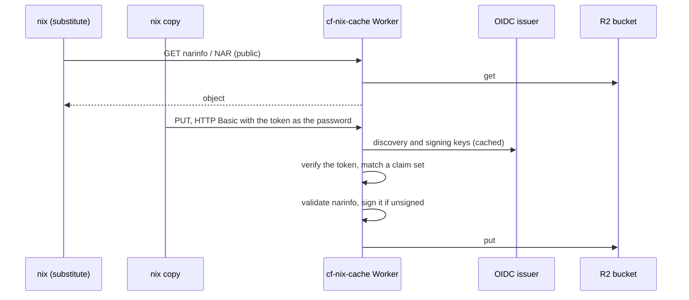

# cf-nix-cache

> A Nix binary cache on Cloudflare Workers and R2: substitutes come from
> Cloudflare's edge, and uploads authenticate with an OIDC token from an issuer
> you trust (GitHub Actions, Cloudflare Access, …), so there's no shared upload
> secret to store or rotate.

[](https://github.com/cf-contrib/cf-nix-cache/actions/workflows/ci.yml)
[](https://www.rust-lang.org/)
[](https://nixos.wiki/wiki/Flakes)
[](LICENSE)

> [!NOTE]
> **Pre-1.0.** The Worker's bindings and the module's inputs may still change
> between minor versions.

| | Ships as | What it is |
|---|---|---|
| [`crates/cf-nix-cache-api`](crates/cf-nix-cache-api) | `index.js` + `index_bg.wasm` in [Releases](https://github.com/cf-contrib/cf-nix-cache/releases) | The server, a Cloudflare Worker written in Rust. Serves narinfo and NARs from R2, validates and signs uploads, and authorizes uploaders by their OIDC token. |
| [`deployment/terraform`](deployment/terraform) | `//deployment/terraform?ref=<version>` | Deploys the released Worker with its R2 bucket and bindings. |

Both are released together from one tag.

## How it works



Reads are public. An upload needs a token from an issuer you configure, for
the cache's audience, that matches one of that issuer's claim sets: for GitHub
Actions, your org's repos on `main`, say; for Cloudflare Access, your team. The
Worker never calls the issuer per request, only for its keys.

The only long-lived secret is the narinfo signing key, in Secrets Store. See the [Worker's README](crates/cf-nix-cache-api#authentication) for the details.

## Do you need it?

Nix supports S3-compatible caches natively with the [`s3://`](https://nix.dev/manual/nix/2.23/store/types/s3-binary-cache-store) store, and R2 speaks the S3 API.

| Approach | Upload credentials | Signing key | Notes |
|---|---|---|---|
| `s3://` to R2 | An S3 key pair per uploader | On every uploader (`secret-key-files`) | Nix built-in; opaque blob storage |
| Public R2 bucket + `s3://` uploads | An S3 key pair per uploader | On every uploader | Anonymous reads via a custom domain |
| **cf-nix-cache** | **A short-lived OIDC token from an issuer you trust** | **In the Worker (Secrets Store)** | Validates narinfo; one-request mass query |

If S3 keys on every uploader are acceptable to you, `s3://` to R2 is less to run.

Also: this is a hobby project. I wanted an excuse to spend more time with Cloudflare Workers and Rust, and a Nix cache made a good target.

## Quick start

1. **Create the signing key.** Generate it with `nix key generate-secret --key-name cache.example.com-1` and store it in Secrets Store. Clients need its public key (`nix key convert-secret-to-public`).
2. **Deploy the Worker** with the [Terraform module](deployment/terraform), on workers.dev (a custom domain is optional), then check that `<cache-url>/health/ready` returns `200`.
3. **Point Nix at it** in `nix.conf`:
   ```ini
   substituters = https://cf-nix-cache.example.workers.dev https://cache.nixos.org
   trusted-public-keys = cache.example.com-1:<base64-public-key> cache.nixos.org-1:6NCHdD59X431o0gWypbMrAURkbJ16ZPMQFGspcDShjY=
   ```
4. **Upload** with `nix copy --to 'https://<cache>?compression=none' <paths>` (the cache stores uncompressed NARs), with the token in a netrc file: that's the only place Nix sends credentials from. In GitHub Actions:
   ```yaml
   permissions:
     contents: read
     id-token: write

   steps:
     - run: nix build .#app
     - name: Upload
       env:
         CACHE: https://cf-nix-cache.example.workers.dev
       run: |
         # A job's OIDC token lasts 5 minutes and Nix rereads the netrc for every
         # request, so a long upload needs it rewritten while it runs: every
         # minute, so a failed refresh or two is retried before the token expires.
         host=${CACHE#*://} && host=${host%%[:/]*}
         netrc() {
           token=$(curl -fsS -H "Authorization: bearer $ACTIONS_ID_TOKEN_REQUEST_TOKEN" \
             "$ACTIONS_ID_TOKEN_REQUEST_URL&audience=$CACHE" | jq -er .value) || return
           echo "::add-mask::$token"
           (umask 077 && printf 'machine %s\n  login oidc\n  password %s\n' \
             "$host" "$token" > "$RUNNER_TEMP/netrc.new")
           mv "$RUNNER_TEMP/netrc.new" "$RUNNER_TEMP/netrc"
         }
         netrc
         (while sleep 60 >/dev/null 2>&1; do netrc || true; done) &
         trap "kill $!" EXIT
         nix copy --to "$CACHE?compression=none" --option netrc-file "$RUNNER_TEMP/netrc" ./result
   ```
   For other issuers, see the [Worker's README](crates/cf-nix-cache-api#authentication). People can upload with their `gh auth token` through a [cf-oidc-auth](https://github.com/cf-contrib/cf-oidc-auth) broker, with [one exchange](crates/cf-nix-cache-api#people-your-github-token-through-cf-oidc-auth) and no refresh.

## Development

Everything runs inside the dev shell (`nix develop`), which pins Rust, `worker-build`, `wrangler` and OpenTofu.

```sh
nix develop -c cargo test                                   # the Worker's and the SDK's tests
(cd deployment/terraform && nix develop -c sh -c "tofu init -backend=false && tofu test")   # the module's tests
```

| Path | |
|---|---|
| [`crates/cf-nix-cache-api`](crates/cf-nix-cache-api#development) | The Worker: the server's handlers and upload auth. Its README covers the bundle, `wrangler dev` and the integration tests. |
| [`crates/cf-nix-cache-sdk`](crates/cf-nix-cache-sdk#generated-code) | The HTTP API's [OpenAPI document](crates/cf-nix-cache-sdk/openapi/nix/cache/v1/cachev1.yaml), and the types, server traits and client `build.rs` generates from it, with the narinfo format. Not published; the Worker builds on it. |
| [`deployment/terraform`](deployment/terraform#development) | The Terraform / OpenTofu module. |

Releases are cut by release-please from Conventional Commits. Each release is tagged `vX.Y.Z` and attaches `index.js` and `index_bg.wasm`. Pin the module to a release tag or its commit SHA: before 1.0 there is no floating major tag, because minor releases may break.

## License

[MIT](LICENSE)
