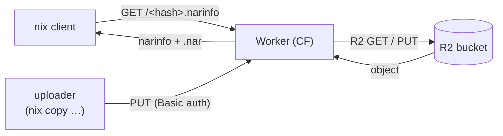

# nix-cache

> Stop babysitting a Nix cache server. Deploy this Worker, point `nix.conf` at it, and substitutes come from Cloudflare's edge.

[](https://github.com/cf-contrib/cf-nix-cache/actions/workflows/ci.yml)
[](https://www.rust-lang.org/)
[](https://nixos.wiki/wiki/Flakes)
[](LICENSE)

A [Nix](https://nixos.org/) binary cache that runs on Cloudflare Workers and R2. Written in Rust.

## Why a Worker, not direct R2/S3?

Nix supports S3-compatible binary caches natively via the
[`s3://`](https://nix.dev/manual/nix/2.23/store/types/s3-binary-cache-store)
store type, and R2 speaks the S3 API. You can also put a public R2 bucket
behind a custom domain and use Nix's
[HTTP Binary Cache Store](https://nix.dev/manual/nix/2.23/store/types/http-binary-cache-store)
for anonymous reads. Both are simpler than running this Worker.

What you get on top of `s3://`:

- Uploaders authenticate as themselves, not with AWS access keys: people with their GitHub token, GitHub Actions with its OIDC token. The `s3://` store uses the AWS default credential provider chain, so every uploader needs a key pair.
- Server-side narinfo signing. The Worker holds the Nix signing key and signs uploads itself; the key never has to live on a CI runner's `secret-key-files`.
- Upload validation. The Worker parses each narinfo, checks the format, binds the StorePath to the request route, and rejects anything unsigned. `s3://` is opaque blob storage.
- `POST /` mass-query in one request. The HTTP Binary Cache protocol supports it; `s3://` falls back to one HEAD per path.

If none of that matters to you, `s3://` to R2 is less code to maintain.

Also: this is a hobby project. I wanted an excuse to spend more time with Cloudflare Workers and Rust, and a Nix cache made a good target.

## Table of contents

- [Why a Worker, not direct R2/S3?](#why-a-worker-not-direct-r2s3)
- [Features](#features)
- [How it works](#how-it-works)
- [Quick start](#quick-start)
- [Authentication](#authentication)
- [HTTP API](#http-api)
- [Configuration](#configuration)
- [Deployment](#deployment)
- [Development](#development)
- [Dependencies](#dependencies)
- [License](#license)

## Features

- Speaks the same protocol as `cache.nixos.org`.
- Reads come from Cloudflare's edge.
- Storage lives in R2 (no egress to Workers).
- Uploads authorized by GitHub identity: push access to a repo for people, claim rules for GitHub Actions OIDC.
- Optional Ed25519 signing of narinfo on the server.
- One Worker bundle: `index.js` plus `index_bg.wasm`.

## How it works



Reads are public. Uploads need HTTP Basic credentials (see [Authentication](#authentication)). Everything lives in one R2 bucket.

## Quick start

### 1. Configure your Nix client

Add the deployed Worker URL to your `nix.conf`:

```ini
substituters = https://<your-worker>.workers.dev https://cache.nixos.org
trusted-public-keys = <your-key-name>:<base64-public-key> cache.nixos.org-1:6NCHdD59X431o0gWypbMrAURkbJ16ZPMQFGspcDShjY=
```

### 2. Push a store path

Put your credentials in a netrc file (see [Authentication](#authentication)), point Nix at it from `nix.conf`:

```ini
netrc-file = /home/you/.netrc
```

and push:

```bash
nix copy --to https://<your-worker>.workers.dev /nix/store/<hash>-<name>
```

### 3. Pull on another machine

```bash
nix build nixpkgs#hello  # served from the Worker if cached
```

## Authentication

Reads are public. Uploads (`PUT`) and `GET /auth/whoami` need HTTP Basic credentials, and the username picks how the Worker checks the password:

| Username       | Password                              | The Worker checks                                                       | Enabled by                                                       |
| -------------- | ------------------------------------- | ----------------------------------------------------------------------- | ---------------------------------------------------------------- |
| `github`       | A GitHub user token (`gh auth token`) | The user has push access to `GITHUB_REPOSITORY`                         | `GITHUB_REPOSITORY`                                              |
| `oidc`         | A GitHub Actions OIDC token           | Signature, issuer, audience, expiry and owner, then `GITHUB_OIDC_RULES` | `GITHUB_OWNER_ID`, `GITHUB_OIDC_AUDIENCE`, `GITHUB_OIDC_RULES`   |
| `x-auth-token` | `NIX_TOKEN`                           | The shared token (legacy)                                               | `NIX_TOKEN`                                                      |

A mechanism is off unless its variables are set. With none set, every upload gets `401`. An invalid configuration, such as only some of the OIDC variables, fails closed: uploads get `500` and the reason is logged.

Every upload is logged with the identity it resolved to. To check your credentials before a long `nix copy`:

```bash
curl --netrc-file ~/.netrc https://<your-worker>.workers.dev/auth/whoami
# {"kind":"github","subject":"octocat"}
```

[gh-nix](https://github.com/gh-extensions/gh-nix) is a planned `gh` extension that will set this up for you ([gh-extensions/gh-nix#1](https://github.com/gh-extensions/gh-nix/issues/1)). Until it ships, write the netrc entries by hand as below.

### People: GitHub token

Anyone with push access to `GITHUB_REPOSITORY` can upload with their own GitHub token. To manage access by team, give the team write access to that repo. The default `gh` token works, and so does nix-auth's. A fine-grained token needs access to that repo.

```
machine <your-worker>.workers.dev
  login github
  password <output of gh auth token>
```

The Worker checks the token with the GitHub API and reuses the result for 5 minutes, keyed by a hash of the token. Tokens are never stored or logged. Removing someone's push access takes effect within those 5 minutes.

GitHub App installation tokens (`ghs_…`, including `GITHUB_TOKEN` in Actions) are rejected. They identify a repo rather than a person, can't be limited to a branch, and fork pull requests get one too. Use OIDC in CI.

### CI: GitHub Actions OIDC

`GITHUB_OIDC_RULES` is a JSON array of rules, and a token is accepted if any rule matches. Within a rule every claim must match. `*` matches any run of characters, including `/`, except in `*_id` claims, which must match exactly. A claim missing from the token never matches.

```json
[
  { "repository_id": "200000002", "ref": "refs/heads/main" },
  { "repository": "example-org/*", "environment": "release" }
]
```

Every token must also come from a repo owned by `GITHUB_OWNER_ID`, because GitHub issues OIDC tokens to every repository on github.com. The token's audience must equal `GITHUB_OIDC_AUDIENCE` (a trailing `/` is ignored). The audience can't be GitHub's default `https://github.com/<owner>`, so a token requested for AWS or GCP doesn't work here.

```yaml
permissions:
  contents: read
  id-token: write

steps:
  # ... build ...
  - name: Authenticate to the Nix cache
    run: |
      token=$(curl -sSf -H "Authorization: Bearer $ACTIONS_ID_TOKEN_REQUEST_TOKEN" \
        "$ACTIONS_ID_TOKEN_REQUEST_URL&audience=https://<your-worker>.workers.dev" | jq -r .value)
      echo "::add-mask::$token"
      printf 'machine <your-worker>.workers.dev\n  login oidc\n  password %s\n' "$token" > "$RUNNER_TEMP/netrc"
      echo "NIX_CONFIG=netrc-file = $RUNNER_TEMP/netrc" >> "$GITHUB_ENV"
  - run: nix copy --to https://<your-worker>.workers.dev ./result
```

> [!WARNING]
> GitHub OIDC tokens expire 5 minutes after they're issued, and the lifetime can't be changed. Fetch the token right before `nix copy`. An upload that runs longer than about 6 minutes (5 minutes plus 60 seconds of clock tolerance) fails partway. gh-nix plans to refresh the token during long uploads.

### Shared token (legacy)

The username is `x-auth-token` and the password is `NIX_TOKEN`. Everyone shares one long-lived token, and nothing ties an upload to a person. Prefer the mechanisms above, and leave `NIX_TOKEN` unset once you've moved to them.

```
machine <your-worker>.workers.dev
  login x-auth-token
  password <NIX_TOKEN>
```

## HTTP API

| Method | Path              | Auth   | Description                                |
| ------ | ----------------- | ------ | ------------------------------------------ |
| `GET`  | `/nix-cache-info` | public | Cache metadata (priority, etc.).           |
| `GET`  | `/<hash>.narinfo` | public | Narinfo for a store path.                  |
| `HEAD` | `/<hash>.narinfo` | public | Existence check for a narinfo (200 / 404). |
| `PUT`  | `/<hash>.narinfo` | basic  | Upload a narinfo.                          |
| `GET`  | `/nar/<hash>.nar` | public | NAR archive bytes.                         |
| `HEAD` | `/nar/<hash>.nar` | public | Existence check for a NAR (200 / 404).     |
| `PUT`  | `/nar/<hash>.nar` | basic  | Upload a NAR archive.                      |
| `GET`  | `/auth/whoami`    | basic  | The identity the credentials resolve to.   |

**Auth:** HTTP Basic, see [Authentication](#authentication). `401` means missing or invalid credentials, `403` means valid credentials without upload access, and `502` means the GitHub API or GitHub's signing keys couldn't be reached.

**Signing:** every stored narinfo carries a `Sig:`. If the uploader didn't sign and `NIX_SECRET` is set, the Worker signs the upload itself. Otherwise the PUT returns `400`.

## Configuration

### Environment variables

| Variable             | Required    | Description                                                                                                      |
| -------------------- | ----------- | ---------------------------------------------------------------------------------------------------------------- |
| `GITHUB_REPOSITORY`  | for `github` | `owner/repo`. Users with push access to it can upload.                                                         |
| `GITHUB_OWNER_ID`    | for `oidc`  | Numeric ID of the GitHub org or user whose repos may upload (`gh api orgs/<org> --jq .id`, or `users/<user>`).   |
| `GITHUB_OIDC_AUDIENCE` | for `oidc` | Expected `aud` of the OIDC token, e.g. the cache URL. Can't be GitHub's default.                               |
| `GITHUB_OIDC_RULES`  | for `oidc`  | JSON array of claim rules; see [CI: GitHub Actions OIDC](#ci-github-actions-oidc).                               |
| `NIX_TOKEN`          | legacy      | Shared upload token (username `x-auth-token`). Leave unset to turn off.                                          |
| `NIX_SECRET`         | conditional | `<key-name>:<base64>` — base64 decodes to 64 Ed25519 secret-key bytes (as emitted by `nix key generate-secret`). Required unless every uploader sends pre-signed narinfo. |

### Bindings

| Binding      | Type      | Description                           |
| ------------ | --------- | ------------------------------------- |
| `NIX_BUCKET` | R2 bucket | Stores `.narinfo` and `.nar` objects. |

## Deployment

Use Terraform with the Cloudflare provider. The [`examples/terraform/`](examples/terraform/) directory has a full example that pulls the Worker bundle from this repo's GitHub Releases and deploys it to Workers + R2.

CI publishes two files to GitHub Releases:

- `build/index.js`
- `build/index_bg.wasm`

Both are required, because `index.js` imports `./index_bg.wasm` at runtime.

> `wrangler.toml` is for local testing, not production.

## Development

The Nix flake gives you a dev shell with the tooling already pinned:

```bash
nix develop -c cargo test           # run the test suite
nix develop -c worker-build --dev   # build the Worker bundle into ./build
nix develop -c wrangler dev         # serve locally via wrangler
```

## Dependencies

Runtime crates:

- [`worker`](https://crates.io/crates/worker) and [`worker-macros`](https://crates.io/crates/worker-macros), the Cloudflare Workers Rust SDK
- [`narinfo`](https://crates.io/crates/narinfo) for parsing and serializing `.narinfo`
- [`http-auth-basic`](https://crates.io/crates/http-auth-basic) for the auth header
- [`serde`](https://crates.io/crates/serde) and [`serde_json`](https://crates.io/crates/serde_json) for OIDC claims, rules and GitHub API responses
- [`web-sys`](https://crates.io/crates/web-sys) for WebCrypto, which verifies OIDC token signatures
- [`ed25519-dalek`](https://crates.io/crates/ed25519-dalek), [`sha2`](https://crates.io/crates/sha2), and [`base64`](https://crates.io/crates/base64) for signing and validation

Tooling:

- Nix, for the dev shell
- `worker-build` (from Cloudflare's `workers-rs`) for the JS + WASM bundle
- `wrangler` for local testing
- Terraform for production

## License

[MIT](LICENSE)
