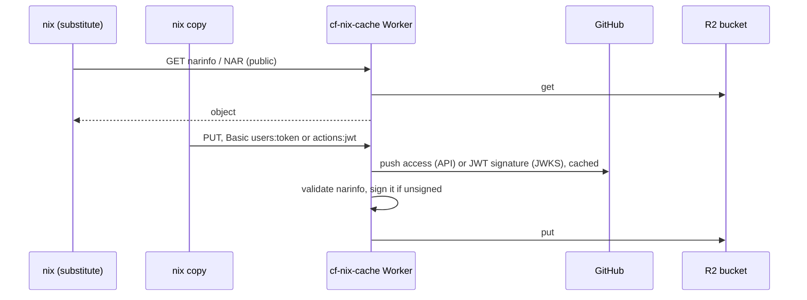

# cf-nix-cache

> A Nix binary cache on Cloudflare Workers and R2: substitutes come from
> Cloudflare's edge, and uploads authenticate with GitHub identity, so there's
> no shared upload secret to store or rotate.

[](https://github.com/cf-contrib/cf-nix-cache/actions/workflows/ci.yml)
[](https://www.rust-lang.org/)
[](https://nixos.wiki/wiki/Flakes)
[](LICENSE)

> [!NOTE]
> **Pre-1.0.** The Worker's bindings, the module's inputs and the action's
> inputs may still change between minor versions.

```yaml
permissions:
  contents: read
  id-token: write

steps:
  - run: nix build .#app
  - uses: cf-contrib/cf-nix-cache@v0.3.0 # x-release-please-version
    with:
      cache-url: https://cf-nix-cache.example.workers.dev
  - run: nix copy --to 'https://cf-nix-cache.example.workers.dev?compression=none' ./result
```

| Component | Ships as | What it is |
|---|---|---|
| [Action](packages/cf-nix-action) | `uses: cf-contrib/cf-nix-cache@<version>` | Sets up a job's OIDC credentials for `nix copy`, and keeps them fresh during long uploads. No runtime dependencies. |
| [Worker](packages/cf-nix-worker) | `index.js` + `index_bg.wasm` in [Releases](https://github.com/cf-contrib/cf-nix-cache/releases) | The cache, written in Rust. Serves narinfo and NARs from R2, validates and signs uploads, and authorizes uploaders by their GitHub identity. |

The Worker, with its Terraform module, and the action are released together from one tag.

## How it works



Reads are public. For uploads, the HTTP Basic username picks the check:

- **`users`**: a person's GitHub token, allowed with push access to one repo. Manage who can upload with that repo's collaborators and teams.
- **`actions`**: a GitHub Actions OIDC token, allowed when it comes from your org and matches a claim rule (repo, branch, environment, …).

The only long-lived secret is the narinfo signing key, in Secrets Store. See the [Worker's README](packages/cf-nix-worker#authentication) for the details.

## Do you need it?

Nix supports S3-compatible caches natively with the [`s3://`](https://nix.dev/manual/nix/2.23/store/types/s3-binary-cache-store) store, and R2 speaks the S3 API.

| Approach | Upload credentials | Signing key | Notes |
|---|---|---|---|
| `s3://` to R2 | An S3 key pair per uploader | On every uploader (`secret-key-files`) | Nix built-in; opaque blob storage |
| Public R2 bucket + `s3://` uploads | An S3 key pair per uploader | On every uploader | Anonymous reads via a custom domain |
| **cf-nix-cache** | **GitHub identity, or the job's OIDC token** | **In the Worker (Secrets Store)** | Validates narinfo; one-request mass query |

If S3 keys on every uploader are acceptable to you, `s3://` to R2 is less to run.

Also: this is a hobby project. I wanted an excuse to spend more time with Cloudflare Workers and Rust, and a Nix cache made a good target.

## Quick start

1. **Create the signing key.** Generate it with `nix key generate-secret --key-name cache.example.com-1` and store it in Secrets Store. Clients need its public key (`nix key convert-secret-to-public`).
2. **Deploy the Worker** with the [Terraform module](packages/cf-nix-worker/terraform), on workers.dev (a custom domain is optional), then check that `<cache-url>/healthz` returns `200`.
3. **Point Nix at it** in `nix.conf`:
   ```ini
   substituters = https://cf-nix-cache.example.workers.dev https://cache.nixos.org
   trusted-public-keys = cache.example.com-1:<base64-public-key> cache.nixos.org-1:6NCHdD59X431o0gWypbMrAURkbJ16ZPMQFGspcDShjY=
   ```
4. **Upload.** In CI, add the [action](packages/cf-nix-action) to a job with `permissions: id-token: write`. People put their GitHub token in a netrc file; see the [Worker's README](packages/cf-nix-worker#people-github-token). Either way, push with `nix copy --to 'https://<cache>?compression=none' <paths>`: the cache stores uncompressed NARs.

## Development

Everything runs inside the dev shell (`nix develop`), which pins Rust, `worker-build`, `wrangler`, OpenTofu and Node.

```sh
nix develop -c cargo test                                     # the Worker's unit tests
(cd packages/cf-nix-action && nix develop -c npm test)       # the action's tests
(cd packages/cf-nix-worker/terraform && nix develop -c sh -c "tofu init -backend=false && tofu test")   # the module's tests
```

Each package's README has the rest: the [Worker](packages/cf-nix-worker#development) (bundle, `wrangler dev`, integration tests), the [action](packages/cf-nix-action#development) and the [module](packages/cf-nix-worker/terraform#development).

Releases are cut by release-please from Conventional Commits. Each release is tagged `vX.Y.Z` and attaches `index.js` and `index_bg.wasm`. Pin the action and the module to a release tag or its commit SHA: before 1.0 there is no floating major tag, because minor releases may break.

## License

[MIT](LICENSE)
